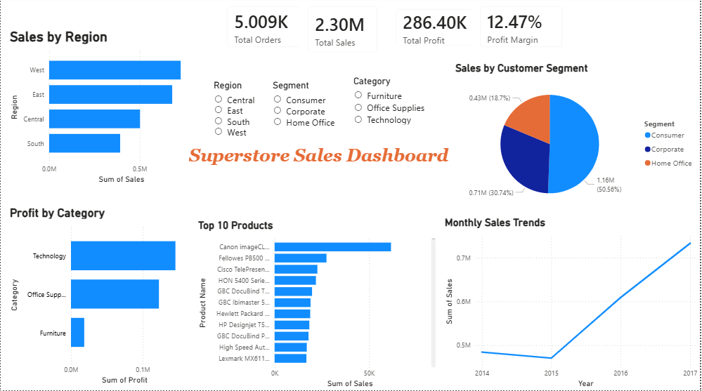

Superstore Sales Data Analysis
Project Objective

The objective of this project is to analyze retail sales data to uncover key business insights related to sales performance, profitability, and customer segments. The analysis helps in understanding trends and supports data-driven decision-making.

Dataset

The dataset consists of 9,994 retail transactions across different regions, product categories, and customer segments.

Key features include:

- Order Date
- Region
- Category & Sub-Category
- Product Name
- Sales
- Profit
- Quantity
- Discount
- Customer Segment

Tools & Technologies

- Python (Pandas, Matplotlib, Seaborn)
- Power BI
- Jupyter Notebook

Analysis Performed
- Exploratory Data Analysis (EDA) on sales data
- Sales performance across regions
- Profit analysis by category
- Top-performing products identification
- Customer segment contribution analysis
- Time-based sales trend analysis

Power BI Dashboard
An interactive dashboard was created using Power BI to visualize:
- Total Sales, Total Profit, Total Orders, Profit Margin
- Sales by Region
- Profit by Category
- Sales by Customer Segment
- Top 10 Products
- Monthly Sales Trends

Key Business Insights
- The West region generates the highest sales, followed by the East region.
- The Technology category contributes the highest profit, while Furniture shows lower profitability.
- A small group of products contributes significantly to total revenue.
- The Consumer segment accounts for the largest share of sales.
- Sales show an increasing trend over time, indicating business growth.

Conclusion

This project demonstrates how retail sales data can be used to identify trends, evaluate business performance, and support strategic decisions. The dashboard provides a clear and interactive way to monitor key metrics and insights.
